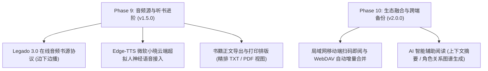

# Legado Desktop 完整开发路线图与里程碑规范 (ROADMAP)

本文档系统记录 **Legado Desktop** 从概念立项、架构选型到各阶段（Phase 1 至 Phase 5）的完整里程碑交付规格，并规划未来演进路线。

---

## 1. 架构总览与技术决策

### 1.1 技术栈对比与选型决策
- **为何选择 Compose Multiplatform (Desktop) 而非 Electron / Flutter**：
  - **性能与内存开销**：Electron 方案随附完整的 Chromium 进程，空载内存通常高达 300MB~500MB；CMP 基于 Skia 原生渲染，空载静置内存稳定控制在 90MB~120MB，冷启动速度在 1.5s 以内。
  - **源码与生态互通**：原版 Legado（Android）为 100% Kotlin 编写；CMP 使得数据模型（Entity）、规则解析（Jsoup/XPath）与业务逻辑能以 0 转译成本无缝移植到 Windows 桌面端。
  - **真正的原生 Material Design 3**：1:1 对齐 Google 官方 Material 3 动画、色彩层级与自适应宽屏栅格断点。

---

## 2. 历史阶段演进记录 (Phase 1 ~ Phase 5)

### 阶段一：MVP 核心可用基线 (Phase 1) — 已交付
- **M1.1 工程底座搭建**：配置 Kotlin 2.0.20 + CMP 1.6.11 构建链，接入 OpenJDK 21 与腾讯云 Gradle 镜像源。
- **M1.2 存储与持久化**：在 Windows `%APPDATA%\LegadoDesktop\legado.db` 建立 SQLite 3 本地数据库，移植 `Book`, `BookSource`, `BookChapter`, `ReadRecord` 核心模型。
- **M1.3 书源解析引擎**：实现 Legado 3.0 JSON 书源规范自动反序列化；构建 Jsoup CSS、XPath、Regex 多范式规则提取器；嵌入 Mozilla Rhino JS 沙箱并注入 `java.ajax`、`java.base64Encode` 等宿主函数。
- **M1.4 大屏 M3 书架与并发搜索**：左侧 Navigation Rail 侧栏导航；网格卡片书架；毫秒级跨书源多协程并发检索。
- **M1.5 沉浸式阅读器**：居中舒适边距排版、大屏图书双页并排阅读（`isDualPage`）、4 款精心校准的护眼阅读主题、键盘快捷键翻页与浮动沉浸 HUD。

### 阶段二：增强体验与多端同步 (Phase 2) — 已交付
- **M2.1 WebDAV 双向云同步**：完整实现 PROPFIND / MKCOL / GET / PUT 客户端，无缝对接坚果云/Nextcloud，与 Android 端共享书架、书源、进度与书签。
- **M2.2 文本净化替换系统**：移植 `ReplaceRule` 规则引擎，在正文渲染前执行正则作用域过滤与批量广告清理。
- **M2.3 书签与笔记系统**：单键书签添加、目录抽屉书签直达与持久化。
- **M2.4 Windows 原生语音朗读 (TTS)**：直接桥接 Windows 底层 `System.Speech` SAPI 语音合成驱动，悬浮多倍速控制条与跨章连续朗读。

### 阶段三：全功能生态扩展 (Phase 3) — 已交付
- **M3.1 漫画与条漫瀑布流模式**：智能识别图文章节中的 `` 标签，实现平滑上下连续滚动浏览。
- **M3.2 内置局域网 Web 服务器**：基于 Ktor 引擎监听端口 `1122`，提供移动端响应式控制台与全套 RESTful API。
- **M3.3 首发版本发布**：完成 GPL-3.0 开源许可、中英双语 README，发布 GitHub Release v1.0.0。

### 阶段四：本地传书、托盘常驻与 CI/CD (Phase 4) — 已交付
- **M4.1 本地小说智能分章**：实现针对 Windows 常见中文编码（UTF-8, GBK, GB18030）的自动嗅探；移植 Legado 经典正则分章提取器；书架提供原生文件对话框。
- **M4.2 Windows 系统托盘常驻**：接入 Compose Desktop 原生 `Tray` 架构，支持最小化至任务栏通知区域，保证后台朗读与 Web 服务不中断。
- **M4.3 GitHub Actions CI/CD**：编写 `.github/workflows/ci.yml`，实现持续构建与测试自动化。

### 阶段五：EPUB 格式支持、专属图标与体积腰斩 (Phase 5) — 已交付
- **M5.1 EPUB 标准电子书解析**：编写 `EpubParser.kt`，完整解包 OCF 容器，抽取元数据、封面与 XHTML 正文。
- **M5.2 专属桌面品牌图标**：生成 Material Design 3 风格高清图标（`icon.png` / `icon.ico`），全链路注入窗口、任务栏、托盘与可执行文件。
- **M5.3 深度瘦身重构**：移除庞大的 `material-icons-extended`（立减 36MB）；配置 Jlink 模块最少依赖（`runtime` 瘦身）；发布 Release v1.1.0。

### 阶段六：发现生态、全系统字体排版与全局硬件热键 (Phase 6) — 已交付 (v1.2.0)
- **M6.1 全网发现与分类榜单引擎**：
  - 完整解析 Legado 3.0 `exploreUrl` 多行与 JSON 数组协议，支持动态分页宏 `{{page}}`、`{{page+1}}`；
  - 适配 `ruleExplore` 与 `ruleSearch` 双重解析回退策略，提供分类标签筛选、卡片网格响应排版、分页及一键直读/加书架；
  - 与全网搜索无缝切合，构建完整的跨源探索体验。
- **M6.2 系统字体库与自定义排版引擎**：
  - Windows `C:\Windows\Fonts` 系统字体库智能枚举（微软雅黑、宋体、黑体、楷体、仿宋、思源等）；
  - 支持直接选取外部 `.ttf` / `.otf` 字体文件，通过 Compose Desktop/Skia 原生引擎零开销动态渲染；
  - 字体路径与名称持久化存储于 SQLite 键值存储库，多端启动自恢复。
- **M6.3 Windows 全局多媒体硬件按键 & 组合键系统**：
  - 零重型外部依赖实现 5KB Win32 原生全局硬件监听进程；
  - 支持标准键盘/耳机多媒体控制按键（`VK_MEDIA_PLAY_PAUSE`, `VK_MEDIA_NEXT_TRACK`, `VK_MEDIA_PREV_TRACK`）及通用快捷键（`Ctrl+Alt+Space/Left/Right`）；
  - 深度联动 `TtsEngine`，实现无焦点、窗口最小化、桌面后台听书时的全局暂停/继续播放与切章。
- **M6.4 极致轻量基线保障**：
  - 持续捍卫 35MB 极小体积设计红线，所有 7 大测试套件 100% 通过。

### 阶段七：智能加权搜索、规则深度兼容、多维书源导入与沉浸触控翻页 (Phase 7) — 已交付 (v1.3.0)
- **M7.1 多维度加权搜索排序引擎 (`SearchRelevanceEngine`)**：
  - **精准匹配置顶**：书名完全匹配赋予 +100,000 绝对高权重分，确保经典原著（如《斗破苍穹》）稳居首位；
  - **标点剥离与归一化**：自动剔除《》、括号等书名号，前缀匹配（+40,000）、包含匹配（+20,000）、作者命中（+50,000）；
  - **完整度奖励与空壳惩罚**：封面、简介、最新章节信息齐全度加权，有效过滤无内容垃圾书。
- **M7.2 Legado 3.0 复杂规则解析器深度重构 (`RuleAnalyzer`)**：
  - **直接属性命中**：支持 `href`、`text`、`textnodes`、`html`、`src` 等原生属性提取，不再误判为 HTML 标签；
  - **降级链路 `||`**：全面支持 `table@tr@td@a||class.list@li@a` 链式备选降级；
  - **多层级 `@` 下钻与负索引**：支持 `tag.a.-1` 取尾项、`0` 取首项、`!0` 排除表头；
  - **智能 URL 补全**：相对路径（`/dir/file.html`）自动补全为规范绝对网络地址。
- **M7.3 终结阅读器无限加载死锁**：
  - 加载状态机严格闭环，超时、网络中断、规则失效等所有异常分支均确保 `isLoading = false`；
  - 提供详细清晰的排查引导提示与建议，顶部增加平滑加载进度条 `LinearProgressIndicator`。
- **M7.4 多维书源导入生态体系 (`BookSourceEngine` & `AppShell`)**：
  - **网络在线 URL 导入**：支持 Legado 一键导入接口与网络 JSON 链接，支持从剪贴板一键嗅探网址；
  - **本地文件导入**：集成原生文件选择器，支持选择本地电脑中的 `.json` 与 `.txt` 书源文件；
  - **剪贴板 / 手动粘贴**：一键贴入 JSON 源码与语法高亮校验；
  - **鲁棒容错解析**：自动解开 API 嵌套包裹（`data`/`list`/`sources`），具备单项损坏自愈跳过能力。
- **M7.5 沉浸式阅读器与安卓端经典触控翻页 (`ReaderView`)**：
  - **三栏触控交互**：左侧向上平滑翻动 85% 视口（章首切上一章）、中间唤起菜单、右侧向下平滑翻动 85% 视口（章尾切下一章），完全不干扰鼠标滚轮滚动；
  - **全屏沉浸阅读**：支持快捷键 `F11` 与界面图标一键全屏沉浸；
  - **高度自由定制**：在阅读设置中提供可视化三栏预览卡片，支持自由调整比例（25:50:25 / 33:34:33 / 20:60:20）与动作映射，配置实时存入 SQLite。

### 阶段八：离线批量缓存、自定义存储管理、仿真滑动翻页与五维精细排版 (Phase 8) — 已交付 (v1.4.0)
- **M8.1 离线批量缓存并发下载引擎 (`BookCacheEngine`)**：
  - **多粒度批量下载**：支持后 50 章、后 100 章、至最新章节、全本书籍批量缓存，支持随时一键中止；
  - **3 协程并发与智能防封禁**：基于 `Semaphore(3)` 控制最大并行数，内置 100ms 动态防封禁请求时延与指数退避重试；
  - **零延迟秒开缓存层**：章节切换优先检索本地 SQLite/文件系统缓存，命中即刻展现正文，彻底消除网络加载等待；
  - **缓存容量统计与一键清理**：递归统计全本及各书缓存体积（GB/MB 自动格式化），支持单本清除与全局清空。
- **M8.2 用户自定义存储目录架构**：
  - **原生目录选择器**：集成系统原生 `JFileChooser` 文件夹选择器，允许用户自由将缓存迁移至大容量非系统盘；
  - **动态路径回退与安全校验**：配置持久化至 SQLite (`cache_custom_dir`)，路径失效时平滑降级至 `%APPDATA%\LegadoDesktop\book_cache`。
- **M8.3 虚拟分页与仿真滑动平移翻页 (`TextPagingEngine` & `ReaderView`)**：
  - **像素级虚拟分页算法**：根据视口实时宽高，结合字号、行高、段间距与全角缩进，精确测算每页字数，实现虚拟断页；
  - **CJK 与 ASCII 视觉宽度加权**：按 1.0 vs 0.55 加权测算中英文与符号宽度，杜绝行尾参差溢出；
  - **双翻页模式自由切换**：支持原生无级平滑滚动 (`SCROLL`) 与经典仿真滑动翻页 (`SLIDE_PAGING`)；
  - **左右横向平移动画**：借助 Compose `AnimatedContent` 实现流畅左右推拉换页动效；
  - **智能页脚状态栏**：翻页模式下实时显示 `第 X / Y 页 · 本章共 Z 字`，章节边界无缝衔接前后章节。
- **M8.4 五维精细排版控制台**：
  - 阅读设置 Tab 0 全面升级为五维精细排版：字体大小、行间距 (1.2x ~ 2.5x)、段间距 (0 ~ 32dp)、首行全角缩进开关、页面外边距 (16/32/64dp)。
- **M8.5 全局非阻塞下载指示器与多入口交互 (`AppShell`)**：
  - **悬浮进度胶囊 (`GlobalDownloadPill`)**：右下角常驻显示下载进度百分比、书名与当前/总章节数，支持后台无感下载与一键中止；
  - **书架卡片一键缓存**：书架每本书籍卡片均配备离线缓存快捷按钮与弹窗；
  - **设置页集中存储管理**：专属“离线缓存与存储管理”卡片，清晰展示路径、已用空间与管理操作。
- **M8.6 自动化测试矩阵扩充**：
  - 扩展至 13 大测试套件、44 项自动化测试，包含缓存读写一致性、体积统计、分页算法与字号缩放等，100% 通过。

---

## 3. 未来路线规划 (Phase 9+)

- **阶段九规划 (v1.5.0)**：
  1. 完整实现 Legado 3.0 音频类书源（支持在线音频流边下边播、锁屏播放控制）。
  2. 接入云端超拟人 Edge-TTS 语音合成引擎（微软小晓、云希大声朗读）。
  3. 支持书籍正文导出（精排 TXT / PDF 打印视图）。
- **阶段十规划 (v2.0.0)**：
  1. 局域网多端互联、移动端扫码即阅及 WebDAV 自动增量合并。
  2. AI 智能辅助阅读（本地小模型或云端 API 提取章节摘要、名词解释、角色关系图谱）。
