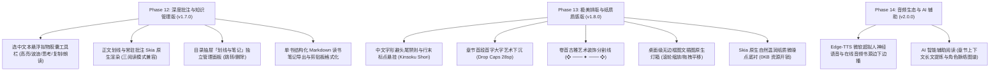

# Legado Desktop 完整开发路线图与里程碑规范 (ROADMAP)

本文档系统记录 **Legado Desktop** 从概念立项、架构选型到各阶段（Phase 1 至 Phase 5）的完整里程碑交付规格，并规划未来演进路线。

---

## 1. 架构总览与技术决策

### 1.1 技术栈对比与选型决策
- **为何选择 Compose Multiplatform (Desktop) 而非 Electron / Flutter**：
  - **性能与内存开销**：Electron 方案随附完整的 Chromium 进程，空载内存通常高达 300MB~500MB；CMP 基于 Skia 原生渲染，空载静置内存稳定控制在 90MB~120MB，冷启动速度在 1.5s 以内。
  - **源码与生态互通**：原版 Legado（Android）为 100% Kotlin 编写；CMP 使得数据模型（Entity）、规则解析（Jsoup/XPath）与业务逻辑能以 0 转译成本无缝移植到 Windows 桌面端。
  - **真正的原生 Material Design 3**：1:1 对齐 Google 官方 Material 3 动画、色彩层级与自适应宽屏栅格断点。

---

## 2. 历史阶段演进记录 (Phase 1 ~ Phase 5)

### 阶段一：MVP 核心可用基线 (Phase 1) — 已交付
- **M1.1 工程底座搭建**：配置 Kotlin 2.0.20 + CMP 1.6.11 构建链，接入 OpenJDK 21 与腾讯云 Gradle 镜像源。
- **M1.2 存储与持久化**：在 Windows `%APPDATA%\LegadoDesktop\legado.db` 建立 SQLite 3 本地数据库，移植 `Book`, `BookSource`, `BookChapter`, `ReadRecord` 核心模型。
- **M1.3 书源解析引擎**：实现 Legado 3.0 JSON 书源规范自动反序列化；构建 Jsoup CSS、XPath、Regex 多范式规则提取器；嵌入 Mozilla Rhino JS 沙箱并注入 `java.ajax`、`java.base64Encode` 等宿主函数。
- **M1.4 大屏 M3 书架与并发搜索**：左侧 Navigation Rail 侧栏导航；网格卡片书架；毫秒级跨书源多协程并发检索。
- **M1.5 沉浸式阅读器**：居中舒适边距排版、大屏图书双页并排阅读（`isDualPage`）、4 款精心校准的护眼阅读主题、键盘快捷键翻页与浮动沉浸 HUD。

### 阶段二：增强体验与多端同步 (Phase 2) — 已交付
- **M2.1 WebDAV 双向云同步**：完整实现 PROPFIND / MKCOL / GET / PUT 客户端，无缝对接坚果云/Nextcloud，与 Android 端共享书架、书源、进度与书签。
- **M2.2 文本净化替换系统**：移植 `ReplaceRule` 规则引擎，在正文渲染前执行正则作用域过滤与批量广告清理。
- **M2.3 书签与笔记系统**：单键书签添加、目录抽屉书签直达与持久化。
- **M2.4 Windows 原生语音朗读 (TTS)**：直接桥接 Windows 底层 `System.Speech` SAPI 语音合成驱动，悬浮多倍速控制条与跨章连续朗读。

### 阶段三：全功能生态扩展 (Phase 3) — 已交付
- **M3.1 漫画与条漫瀑布流模式**：智能识别图文章节中的 `` 标签，实现平滑上下连续滚动浏览。
- **M3.2 内置局域网 Web 服务器**：基于 Ktor 引擎监听端口 `1122`，提供移动端响应式控制台与全套 RESTful API。
- **M3.3 首发版本发布**：完成 GPL-3.0 开源许可、中英双语 README，发布 GitHub Release v1.0.0。

### 阶段四：本地传书、托盘常驻与 CI/CD (Phase 4) — 已交付
- **M4.1 本地小说智能分章**：实现针对 Windows 常见中文编码（UTF-8, GBK, GB18030）的自动嗅探；移植 Legado 经典正则分章提取器；书架提供原生文件对话框。
- **M4.2 Windows 系统托盘常驻**：接入 Compose Desktop 原生 `Tray` 架构，支持最小化至任务栏通知区域，保证后台朗读与 Web 服务不中断。
- **M4.3 GitHub Actions CI/CD**：编写 `.github/workflows/ci.yml`，实现持续构建与测试自动化。

### 阶段五：EPUB 格式支持、专属图标与体积腰斩 (Phase 5) — 已交付
- **M5.1 EPUB 标准电子书解析**：编写 `EpubParser.kt`，完整解包 OCF 容器，抽取元数据、封面与 XHTML 正文。
- **M5.2 专属桌面品牌图标**：生成 Material Design 3 风格高清图标（`icon.png` / `icon.ico`），全链路注入窗口、任务栏、托盘与可执行文件。
- **M5.3 深度瘦身重构**：移除庞大的 `material-icons-extended`（立减 36MB）；配置 Jlink 模块最少依赖（`runtime` 瘦身）；发布 Release v1.1.0。

### 阶段六：发现生态、全系统字体排版与全局硬件热键 (Phase 6) — 已交付 (v1.2.0)
- **M6.1 全网发现与分类榜单引擎**：
  - 完整解析 Legado 3.0 `exploreUrl` 多行与 JSON 数组协议，支持动态分页宏 `{{page}}`、`{{page+1}}`；
  - 适配 `ruleExplore` 与 `ruleSearch` 双重解析回退策略，提供分类标签筛选、卡片网格响应排版、分页及一键直读/加书架；
  - 与全网搜索无缝切合，构建完整的跨源探索体验。
- **M6.2 系统字体库与自定义排版引擎**：
  - Windows `C:\Windows\Fonts` 系统字体库智能枚举（微软雅黑、宋体、黑体、楷体、仿宋、思源等）；
  - 支持直接选取外部 `.ttf` / `.otf` 字体文件，通过 Compose Desktop/Skia 原生引擎零开销动态渲染；
  - 字体路径与名称持久化存储于 SQLite 键值存储库，多端启动自恢复。
- **M6.3 Windows 全局多媒体硬件按键 & 组合键系统**：
  - 零重型外部依赖实现 5KB Win32 原生全局硬件监听进程；
  - 支持标准键盘/耳机多媒体控制按键（`VK_MEDIA_PLAY_PAUSE`, `VK_MEDIA_NEXT_TRACK`, `VK_MEDIA_PREV_TRACK`）及通用快捷键（`Ctrl+Alt+Space/Left/Right`）；
  - 深度联动 `TtsEngine`，实现无焦点、窗口最小化、桌面后台听书时的全局暂停/继续播放与切章。
- **M6.4 极致轻量基线保障**：
  - 持续捍卫 35MB 极小体积设计红线，所有 7 大测试套件 100% 通过。

### 阶段七：智能加权搜索、规则深度兼容、多维书源导入与沉浸触控翻页 (Phase 7) — 已交付 (v1.3.0)
- **M7.1 多维度加权搜索排序引擎 (`SearchRelevanceEngine`)**：
  - **精准匹配置顶**：书名完全匹配赋予 +100,000 绝对高权重分，确保经典原著（如《斗破苍穹》）稳居首位；
  - **标点剥离与归一化**：自动剔除《》、括号等书名号，前缀匹配（+40,000）、包含匹配（+20,000）、作者命中（+50,000）；
  - **完整度奖励与空壳惩罚**：封面、简介、最新章节信息齐全度加权，有效过滤无内容垃圾书。
- **M7.2 Legado 3.0 复杂规则解析器深度重构 (`RuleAnalyzer`)**：
  - **直接属性命中**：支持 `href`、`text`、`textnodes`、`html`、`src` 等原生属性提取，不再误判为 HTML 标签；
  - **降级链路 `||`**：全面支持 `table@tr@td@a||class.list@li@a` 链式备选降级；
  - **多层级 `@` 下钻与负索引**：支持 `tag.a.-1` 取尾项、`0` 取首项、`!0` 排除表头；
  - **智能 URL 补全**：相对路径（`/dir/file.html`）自动补全为规范绝对网络地址。
- **M7.3 终结阅读器无限加载死锁**：
  - 加载状态机严格闭环，超时、网络中断、规则失效等所有异常分支均确保 `isLoading = false`；
  - 提供详细清晰的排查引导提示与建议，顶部增加平滑加载进度条 `LinearProgressIndicator`。
- **M7.4 多维书源导入生态体系 (`BookSourceEngine` & `AppShell`)**：
  - **网络在线 URL 导入**：支持 Legado 一键导入接口与网络 JSON 链接，支持从剪贴板一键嗅探网址；
  - **本地文件导入**：集成原生文件选择器，支持选择本地电脑中的 `.json` 与 `.txt` 书源文件；
  - **剪贴板 / 手动粘贴**：一键贴入 JSON 源码与语法高亮校验；
  - **鲁棒容错解析**：自动解开 API 嵌套包裹（`data`/`list`/`sources`），具备单项损坏自愈跳过能力。
- **M7.5 沉浸式阅读器与安卓端经典触控翻页 (`ReaderView`)**：
  - **三栏触控交互**：左侧向上平滑翻动 85% 视口（章首切上一章）、中间唤起菜单、右侧向下平滑翻动 85% 视口（章尾切下一章），完全不干扰鼠标滚轮滚动；
  - **全屏沉浸阅读**：支持快捷键 `F11` 与界面图标一键全屏沉浸；
  - **高度自由定制**：在阅读设置中提供可视化三栏预览卡片，支持自由调整比例（25:50:25 / 33:34:33 / 20:60:20）与动作映射，配置实时存入 SQLite。

### 阶段八：离线批量缓存、自定义存储管理、仿真滑动翻页与五维精细排版 (Phase 8) — 已交付 (v1.4.0)
- **M8.1 离线批量缓存并发下载引擎 (`BookCacheEngine`)**：
  - **多粒度批量下载**：支持后 50 章、后 100 章、至最新章节、全本书籍批量缓存，支持随时一键中止；
  - **3 协程并发与智能防封禁**：基于 `Semaphore(3)` 控制最大并行数，内置 100ms 动态防封禁请求时延与指数退避重试；
  - **零延迟秒开缓存层**：章节切换优先检索本地 SQLite/文件系统缓存，命中即刻展现正文，彻底消除网络加载等待；
  - **缓存容量统计与一键清理**：递归统计全本及各书缓存体积（GB/MB 自动格式化），支持单本清除与全局清空。
- **M8.2 用户自定义存储目录架构**：
  - **原生目录选择器**：集成系统原生 `JFileChooser` 文件夹选择器，允许用户自由将缓存迁移至大容量非系统盘；
  - **动态路径回退与安全校验**：配置持久化至 SQLite (`cache_custom_dir`)，路径失效时平滑降级至 `%APPDATA%\LegadoDesktop\book_cache`。
- **M8.3 虚拟分页与仿真滑动平移翻页 (`TextPagingEngine` & `ReaderView`)**：
  - **像素级虚拟分页算法**：根据视口实时宽高，结合字号、行高、段间距与全角缩进，精确测算每页字数，实现虚拟断页；
  - **CJK 与 ASCII 视觉宽度加权**：按 1.0 vs 0.55 加权测算中英文与符号宽度，杜绝行尾参差溢出；
  - **双翻页模式自由切换**：支持原生无级平滑滚动 (`SCROLL`) 与经典仿真滑动翻页 (`SLIDE_PAGING`)；
  - **左右横向平移动画**：借助 Compose `AnimatedContent` 实现流畅左右推拉换页动效；
  - **智能页脚状态栏**：翻页模式下实时显示 `第 X / Y 页 · 本章共 Z 字`，章节边界无缝衔接前后章节。
- **M8.4 五维精细排版控制台**：
  - 阅读设置 Tab 0 全面升级为五维精细排版：字体大小、行间距 (1.2x ~ 2.5x)、段间距 (0 ~ 32dp)、首行全角缩进开关、页面外边距 (16/32/64dp)。
- **M8.5 全局非阻塞下载指示器与多入口交互 (`AppShell`)**：
  - **悬浮进度胶囊 (`GlobalDownloadPill`)**：右下角常驻显示下载进度百分比、书名与当前/总章节数，支持后台无感下载与一键中止；
  - **书架卡片一键缓存**：书架每本书籍卡片均配备离线缓存快捷按钮与弹窗；
  - **设置页集中存储管理**：专属“离线缓存与存储管理”卡片，清晰展示路径、已用空间与管理操作。
- **M8.6 自动化测试矩阵扩充**：
  - 扩展至 13 大测试套件、44 项自动化测试，包含缓存读写一致性、体积统计、分页算法与字号缩放等，100% 通过。

### 阶段九：大屏真实双页对开、滚轮阻尼翻页与四角沉浸状态栏 (Phase 9) — 已交付 (v1.4.1 极致阅读轻量补完版)
- **M9.1 大屏真实双页对开仿真排版 (`TextPagingEngine` & `ReaderView`)**：
  - **终结单栏右侧占位符**：深度重构双页模式，基于视口精确计算双栏布局，左栏渲染 Page N，右栏渲染 Page N+1；
  - **跨章节连续无缝拼接**：当本章末尾为奇数页时，智能预拉取下一章节并将其第 1 页并排在右栏呈现，彻底终结翻空白页割裂感；
  - **双页步进与书脊阴影**：前进/后退一次翻动 2 页，中间带有纸质书脊的雅致微阴影（Book Spine Divider）。
- **M9.2 智能阻尼累积鼠标滚轮翻页与全键盘调优**：
  - **物理阻尼累积算法**：在仿真滑动分页与双页模式下接入 Compose 原生滚轮事件，设定 1.0f 累积阈值与 250ms 适度防抖；
  - **自然跟手手感**：自然轻拨一次滚轮恰好翻 1 页（双页模式前进 2 页），杜绝高刷平滑鼠标一次性暴滑多页；
  - **全键盘快捷键覆盖**：方向键、PageUp/Down、空格、Vim 风格 J/K 键全面对齐。
- **M9.3 经典四角沉浸状态栏与多维信息呈现**：
  - **四角沉浸布局**：顶部左侧【书名/章节名】、顶部右侧【Windows 实时系统时间】；底部左侧【全书阅读进度百分比】、底部右侧【章内页码与字数统计】；
  - **状态栏独立控制**：在阅读设置中提供“显示页眉/页脚状态信息”开关，持久化写入 SQLite。
- **M9.4 单元测试用例扩充**：
  - 增加双页跨章分页拆分、奇数末页拼接、滚轮累积阻尼阈值与防抖、状态栏全书进度与时间等 5 项自动化测试，测试用例扩充至 49 项，持续保持 100% 测试通过率。

### 阶段十：所见即所得侧边设置抽屉、8款护眼主题与自定义调色、章内Ctrl+F检索与鼠标划线摘录 (Phase 10) — 已交付 (v1.5.0 极致沉浸阅读大版本)
- **M10.1 所见即所得半透明侧边设置抽屉 (`SettingsDrawer`)**：
  - 彻底终结居中 AlertDialog 遮挡正文顽疾，重构为右侧 360dp 平滑滑出式半透明侧边抽屉；
  - 字号、行距、段间距、页边距、首行缩进、状态栏开关即调即显，左侧正文实时动态响应，所见即所得；
  - 支持快捷键 Esc、关闭按钮或外部区域平滑关闭。
- **M10.2 8款精选护眼主题矩阵与自定义 Hex 调色盘**：
  - 覆盖全天候光照场景的 8 款专业色系：象牙白 (DAY)、羊皮纸 (PARCHMENT)、豆沙绿 (BEAN_GREEN)、苍山暮 (TWILIGHT)、远峰蓝夜 (OCEAN_BLUE)、水墨电纸白 (E_INK)、极夜纯黑 (OLED_BLACK)、护眼柔绿 (GREEN)；
  - 新增用户自定义调色模式 (CUSTOM)，支持输入十六进制色值（底色与文字颜色），实时解析并持久化保存至 SQLite 数据库。
- **M10.3 章内全文快速检索与琥珀金高亮联动 (`Ctrl+F`)**：
  - 顶部悬浮轻量搜索栏，即时高亮当前章所有命中关键词（琥珀金 `#FFD54F` 优雅高亮，当前激活项高亮区分）；
  - 实时显示匹配计数（如 `第 3 / 15 处`），支持上一个/下一个导航与回车联动；
  - 智能跨页联动：在平移分页或双页模式下自动计算并翻至命中项所在页，滚动模式平滑定位，按 Esc 退出。
- **M10.4 鼠标原生划线选取与选段智能捕获书签 (`SelectionContainer`)**：
  - 接入 Compose Desktop `SelectionContainer`，支持鼠标自由拖拽高亮选取文字，原生支持 Windows 剪贴板 `Ctrl+C` 复制；
  - 点击书签图标或快捷键时，智能探测剪贴板中匹配的正文选段，优先将用户划选的原句填入摘录卡片，支持用户附加强化批注。
- **M10.5 自动化测试与质量基准持续守护**：
  - 新增 `Phase10FeatureTest` 专项测试套件（覆盖主题枚举、Hex 动态解析、章内全文检索索引、多页跨页映射与边界条件），测试矩阵扩充至 15 大套件、54 项自动化测试，保持 100% 通过。

### 阶段十一：绿色便携目录、百兆大文件纯字节偏移流式秒开、全局拖拽入库与智能分章自愈 (Phase 11) — 已交付 (v1.6.0 本地书籍极致秒开版)
- **M11.1 绿色便携优先存储架构 (`LocalBookImporter`)**：
  - 本地书籍私有存储优先定位为程序解压/安装目录下的 `./local_books/`（便携绿色版优先，移动硬盘拷走即用）；
  - 智能盘符变动重定位与旧版 `%APPDATA%\LegadoDesktop\local_books` 平滑向下兼容，系统只读权限下自动安全降级。
- **M11.2 全量纯字节偏移量流式索引架构 (`RandomAccessFile Offset Engine`)**：
  - 彻底淘汰旧版生成成百上千个 `chapter_X.txt` 碎片切片文件的机制，本地 TXT 导入仅做单遍极速字符流扫描，在 SQLite 中记录 `[startByte, endByte]` 索引；
  - 百兆长篇小说在 200ms 内完成秒级入库与内存零压力，阅读翻章时通过 `RandomAccessFile.seek` 毫秒级精准切片读取。
- **M11.3 Windows 全局拖拽入库 (`Native Drag & Drop`)**：
  - 基于 AWT 原生 `DropTarget` 接入 `ComposeWindow`，监听 `javaFileListFlavor` 拖拽事件；
  - 窗口检测到文件悬停时平滑浮现半透明发光虚线靶心与“📥 松开鼠标即可将书籍导入书架”动效；
  - 自动过滤并批量解析 `.txt` / `.epub`，异步批量导入并在底部弹出 Toast 反馈。
- **M11.4 目录抽屉「⚙️ 分章微调」自愈面板**：
  - 目录抽屉顶部新增「分章微调」快捷入口；
  - 内置 4 套经典预设（标准中文、英文字段、数字序号、网络特殊符号）与自定义正则表达式；
  - **实时匹配预览**：即时反馈命中章节数与前 3~5 章标题样本，一键重整目录索引并即时刷新阅读器。
- **M11.5 自动化测试与质量基准**：
  - 新增 `Phase11FeatureTest` 专项测试套件（便携目录解析、大文本字节偏移流式扫描与精准 Seek 读取、预设与自定义正则匹配、特殊网络符号重整目录与路径容灾）；
  - 测试矩阵扩充至 **16 大测试套件、59 项自动化测试**，持续保持 100% 通过率。

### 阶段十二：鼠标浮动划线工具栏、多色高亮与批注、知识管理与结构化 Markdown 导出 (Phase 12) — 已交付 (v1.7.0 深度批注与知识管理版)
- **M12.1 选中文本浮动拟物胶囊工具栏 (`FloatingAnnotationToolbar`)**：
  - 基于 Compose Desktop `SelectionContainer` 与自定义 `TextToolbar`，选中文本即刻弹出悬浮拟物毛玻璃药丸工具栏；
  - 提供多维即时操作：🟡 黄色高亮、🟢 绿色高亮、🟣 紫色高亮、〰️ 波浪下划线、✏️ 深度写想法/笔记、📋 原生剪贴板复制、🔊 选中文本 TTS 语音朗读、✖ 关闭。
- **M12.2 Skia 原生多层复合渲染引擎 (`buildHighlightedText`)**：
  - 底层基于 Skia 与 Compose `AnnotatedString` 样式层级机制，深度支持单页、对开双页与连续无级滚动三种阅读模式；
  - **双层视觉合并架构**：第一层平滑渲染用户常驻划线与下划线标记，第二层顶层叠加高对比度关键字检索高亮（琥珀金/橙色），层次分明且互不覆盖。
- **M12.3 目录抽屉「划线与笔记」专属管理面板 (`ReaderView`)**：
  - 目录抽屉由双 Tab 升级为三 Tab：【章节目录】、【划线与笔记】、【书签记录】；
  - 划线与笔记列表清晰展现彩色徽标、所属章节、划线原文引用块、💡 用户感悟想法与时间戳；
  - 支持单条点击即刻跳转对应章节、单条精准删除、实时统计全书划线条数。
- **M12.4 结构化 Markdown 知识库导出引擎 (`MarkdownExportEngine`)**：
  - 自动将书籍元数据、章节层级、引用块、批注想法及书签整理为精美排版的 `.md` 格式；
  - 提供【复制 Markdown】（一键复制至 Windows 剪贴板）与【导出 .md】（调用系统原生保存文件对话框，全量 UTF-8 防乱码写入），无缝对接 Obsidian、Logseq、Notion 等知识管理软件。
- **M12.5 自动化测试与质量基准持续守护**：
  - 新增 `Phase12FeatureTest` 专项测试套件（SQLite 批注模型 CRUD、书籍删除级联清理、Markdown 导出结构化排版与特殊字符转义、Skia 多层划线与搜索高亮叠加、彩色徽标映射）；
  - 测试矩阵扩充至 **17 大测试套件、64 项自动化测试**，持续保持 100% 通过率。

### 阶段十三：中文字形避头尾禁则、首字下沉、卷首装饰、无边框原生灯箱与纸质微噪点底衬 (Phase 13) — 已交付 (v1.8.0 极美排版与纸质质感版)
- **M13.1 严格中文避头尾禁则与标点智能悬挂 (`Kinsoku Shori & Punctuation Hanging`)**：
  - 深度遵守排版学禁则：后置标点（`，。！？、；：”’）》】`等）严禁单独出现在行首，前置标点（`“‘（《【`等）严禁单独孤立在行尾；
  - **行末标点智能微悬挂**：当行末遇到后置标点且超出版面微小容差（0.1 字宽）时，允许标点悬挂在版心右侧边框之外，避免行末大幅度参差不齐；
  - **禁则自动回退换行**：若无法悬挂，自动将前一字前移至下一行，确保换行后的首字符始终为汉字或安全字符，彻底消除“逗号在行首”的粗糙感。
- **M13.2 章节首段首字艺术大字下沉 (`Drop Caps`)**：
  - 首段首字自动提取并跳过缩进空白与标点，以 28sp 特粗体（ExtraBold）艺术化呈现；
  - 适配单页、双页对开（仅左页首段或新章右页呈现）及连续滚动模式，带来经典欧洲典籍与中文古雅典藏的沉浸式排版氛围。
- **M13.3 卷轴风卷首艺术装饰分割线 (`Art Title Divider`)**：
  - 在章节标题下方渲染古雅对称印记（`❖ ─── ✦ ─── ❖`），增强翻章仪式感与古籍卷轴感；
  - 排版设置抽屉提供独立开关，兼顾极简主义读者与古典雅致读者偏好。
- **M13.4 桌面级无边框图文插图原生灯箱 (`Image Lightbox`)**：
  - 点击插图或漫画条漫卡片即刻弹出全屏暗化原生灯箱画廊；
  - **物理级平滑缩放与平移**：支持鼠标滚轮无级缩放（0.5x ~ 5.0x）、高倍率下鼠标拖拽全向平移原图、双击 100% 快速复位；
  - 顶部悬浮毛玻璃药丸工具条集成 `+`、`-`、`100% 复位` 与 `关闭` 快捷操作。
- **M13.5 Skia 原生温润纸质微噪点底衬 (`PaperTextureCanvas`)**：
  - 消除传统电子白光底色的刺眼感，采用 Skia 实时伪随机微米级微噪点网格算法；
  - **0 额外图片体积**：无需打包数兆的 4K 纸质贴图素材，运行期轻量渲染无闪烁固定质感；
  - 排版设置抽屉新增独立控制开关与 2% ~ 20% 浓度微调滑块，并全面通过 SQLite 持久化。
- **M13.6 自动化测试与质量基准持续守护**：
  - 新增 `Phase13FeatureTest` 专项测试套件（避头尾行首禁则校验、行尾禁则校验、标点微悬挂行宽对齐、首字大字下沉样式与字符偏移量提取、排版美学与纸质底衬设置持久化）；
  - 测试矩阵扩充至 **18 大测试套件、69 项自动化测试**，持续保持 100% 通过率。

---

## 3. 未来路线规划 (Phase 14+)

- **阶段十四规划 (v2.0.0 音频生态与 AI 辅助)**：
  1. 接入 Edge-TTS 微软超拟人神经语音与 Legado 3.0 在线音频书源边下边播。
  2. AI 智能辅助阅读（章节长文提炼与角色脉络图谱）。

